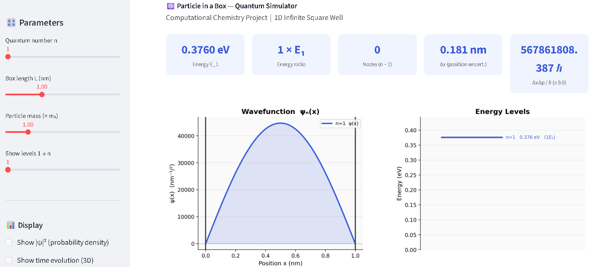
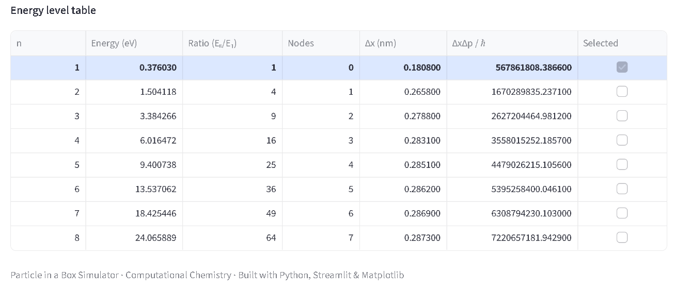
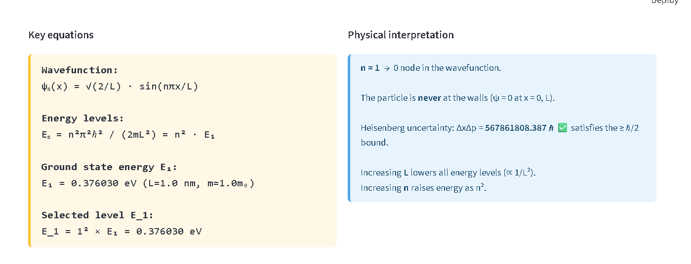

# Particle in a Box — Quantum Simulator

**Computational Chemistry Project**
Interactive 1D infinite square well simulator built with Python, Streamlit, and Matplotlib.

---

## Live Demo

Run locally at: http://localhost:8501

---

## What it does

This simulator lets you explore the quantum mechanics of a particle trapped inside a 1D infinite potential well. You can:

* Visualise the wavefunction **ψₙ(x)** and probability density **|ψₙ(x)|²**
* See energy levels on an interactive diagram
* Adjust box length **L** and particle mass **m** in real time
* Observe node structure (**n − 1 nodes**)
* Check Heisenberg uncertainty relation **ΔxΔp ≥ ℏ/2**
* View computed energy values dynamically

---

## Theory

For a particle of mass *m* in a box of length *L* with infinite walls:

| Quantity             | Formula                       |
| -------------------- | ----------------------------- |
| Wavefunction         | `ψₙ(x) = √(2/L) · sin(nπx/L)` |
| Energy               | `Eₙ = n²π²ℏ² / (2mL²)`        |
| Position uncertainty | `Δx = L√(1/12 − 1/(2n²π²))`   |
| Momentum uncertainty | `Δp = nπℏ / L`                |

**Boundary conditions:** ψ(0) = ψ(L) = 0 → only standing waves allowed

---

## Why this project matters

This simulator bridges abstract quantum theory and visual understanding.
It helps students intuitively grasp wavefunctions, energy quantisation, and uncertainty principles through interactive visualization.

---

## Project Structure

```
particle_in_box/
│── app.py
│── computation_chem.py
│── README.md
│── requirements.txt
│── assets/
│     ├── wavefunction.png
│     ├── energy.png
│     ├── theory_section.png
```

---

## How to Run

### 1. Clone the repository

```bash
git clone https://github.com/<your-username>/particle-in-box.git
cd particle-in-box
```

### 2. Install dependencies

```bash
pip install -r requirements.txt
```

### 3. Run the app

```bash
streamlit run app.py
```

---

## Screenshots







---

## Key Concepts Demonstrated

* Quantisation of energy (discrete energy levels)
* Wavefunction behaviour and node structure
* Energy dependence on **n²** and **1/L²**
* Heisenberg uncertainty principle
* Boundary conditions in quantum systems

---

## Dependencies

| Package    | Purpose                |
| ---------- | ---------------------- |
| streamlit  | Web interface          |
| numpy      | Numerical calculations |
| matplotlib | Plotting graphs        |
| pandas     | Data handling          |

---

## Author

**Arnav Choubey**
B.Tech CSE, VIT Bhopal

---

## License

MIT License — free to use and modify for educational purposes.
